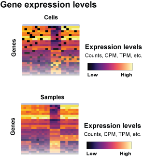
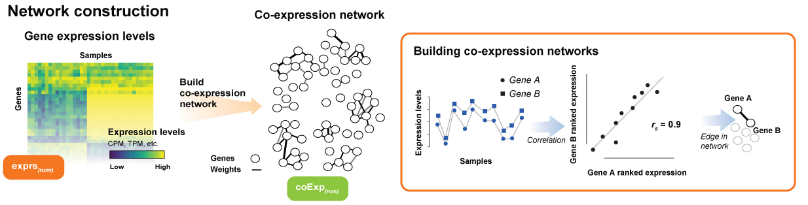
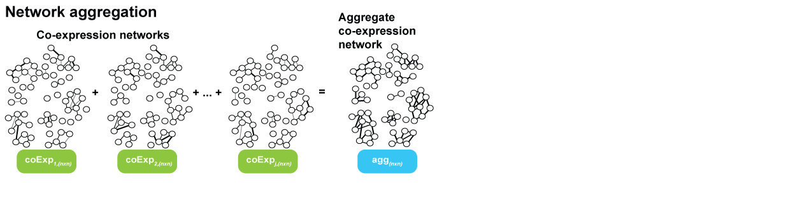
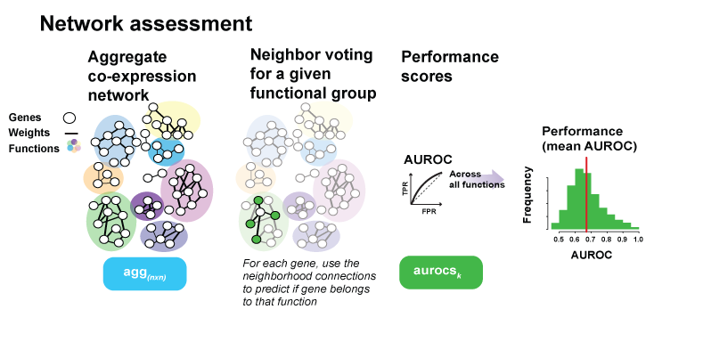
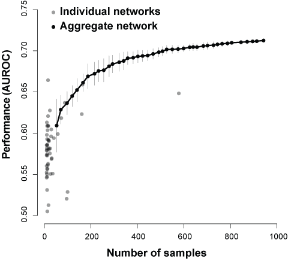

# CoExpNets
How-to generate and analyze co-expression aggregate networks

_Guidance for RNA-seq co-expression network construction and analysis: safety in numbers_
S. Ballouz  W. Verleyen  J. Gillis
Bioinformatics, Volume 31, Issue 13, 1 July 2015, Pages 2123–2130,
https://doi.org/10.1093/bioinformatics/btv118


## Basics 
### 1. Get expression experiment 
``` 
load("bin/run_GBA.Rdata")
load("data/GO.human.Rdata")
source("/bin/helper_functions.r")
library(EGAD)

exprs_file = "GSE12946_expression_FPKM.parsed"
exprs = read.table(file=exprs_file, header=T)
```


### 2. Rank standardize by sample 
Note, this step is not necessary if using spearman correlations in the next step. 
``` 
exprs = rank(exprs, na.last="keep")
exprs  exprs/max(exprs, na.rm=T)
```

### 3. Calculate network edges using correlations
Note, spearman correlations are recommended. 
``` 
network = make_network(exprs) 
```


### 4. Rank standardize network
```
n = dim(network)[1]
network = matrix(rank(network, na.last="keep",ties.method="average"), nrow=n, ncol=n)
```
### 5. Aggregation  
#### a. Repeat on other expression experiments and aggregate 
see ```agg_network.r```


  
#### b. Other 
If there aren''t enough datasets, you can hard threshold by taking the top 0.1% of connections:  
```
network = threshold_network_top_genes(network, 0.001)
```
Or not ranking the matrix and then raising it to a power - also known as soft thresholding. See WGCNA: https://horvath.genetics.ucla.edu/html/CoexpressionNetwork/Rpackages/WGCNA/faq.html


### 6. Test for network functionality 
``` 
GBA = run_GBA(network, GO.labels)
``` 
 

As increasing the number of samples increases performance, aggregation is recommended. 


